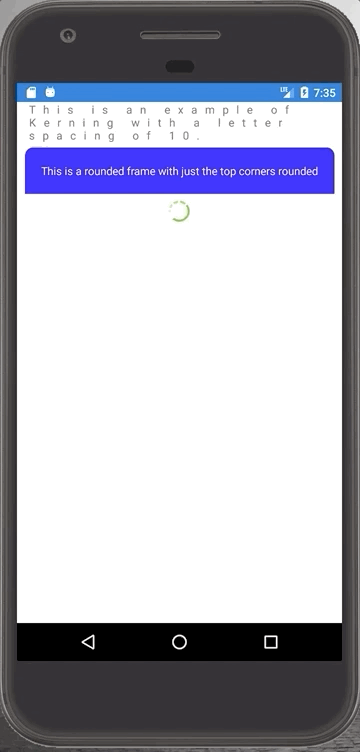

# PhantomLib
Collection of Xamarin additions that are ready to consume.

# Installation
You must make a call to initialize after `Forms.Init` and before `LoadApplication` in order to use the effects from this library in `AppDelegate.cs` (iOS) and/or `MainActivity.cs` (Android).

**Android:**
  ```
global::Xamarin.Forms.Forms.Init(this, savedInstanceState);
PhantomLib.Android.Effects.Effects.Init();
LoadApplication(new App());
```
**iOS:**
```
LoadApplication(new  App());  
PhantomLib.iOS.Effects.Effects.Init();  
return base.FinishedLaunching(app,  options);
```
            


# Effects included in this library
* Kerning Effect - Allows you to specify the letter spacing of your lables.
* Spinner Effect - Allows you to have a custom activity indicator. Just supply an image and duration (how long it takes for one rotation) and the effect will rotate it.

# Custom controls in this library
* RoundedFrame - Allows you to spcify which corners of a frame are rounded.


# Sample


