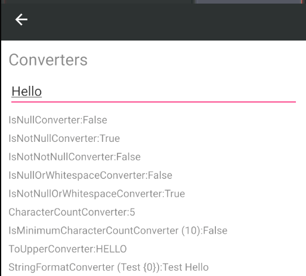

# PhantomLib
Collection of Xamarin controls, converters, behaviors, effects that will speed your developement time.
Note: Version 2.x of this package is not backward compatible with 1.x.

# Effects included in this library
* Kerning Effect - Allows you to specify the letter spacing of your labels.


* TintImage Effect - Allows you to change the color of an image.


# Custom controls in this library
* RoundedFrame - No longer is rounding corners on a frame an all or nothing affair. With RoundedFrame, you're in control of which corners are rounded and which aren't. Only need the left corners rounded? No problem. Only the top left corner? We can do that too. Any combination of corners can be rounded.


* UltimateEntry - The UltimateEntry control jam packed with functionality. Features include being able to set an icon on the right that will clear the contents when tapped. You can also use it as a password entry and set an icon to show and hide the password by tapping it. You can have it validate input and show an error when validation fails. You can also style it like material design by having an underline on the bottom.

* FloatingLabel - This control is used with the UltimateControl to "float" the placeholder while entering text.


# Behaviors included in this library
* Tap Command Behavior - Allows you to bind an `ICommand` to be executed when a control is tapped.


# Converters included in this library
* CharacterCountConverter - Counts the characters in a string
* InverseBoolConverter - Inverses Boolean values
* IsMinimumCharacterCountConverter - Counts the characters in a string and determines if it meets a minimum count
* IsMinimumValueConverter - Determines if a number meets a minimum count
* IsNullConverter - Determines if a value is null
* IsNullOrWhitespace - Determines if a string value is null or whitespace
* IsNotNullConverter - Determines if a value is not null (inverse of IsNullConverter)
* IsNotNullOrWhitespace - Determines if a string value is not null or whitespace (inverse of IsNullOrWhitespaceConverter)
* StringFormatConverter - Safely formats strings (handles case where format string is not a valid .NET format string)
* ToUpperConverter - Uppercases each character in a string (culture-specific)


# Attached Properties in this library
* Labels.Kerning - Helper to easily add Kerning Effect
* Views.TapBackgroundColor - Set the temporary background color of a view when it is tapped


* Pages.FloatingActionButton - Add a Button to the page as a floating action button.


# Other helpers included in this library
* BaseAttachable - Acts as a base class for view-models, with helpers to easily raise `IPropertyChanged` events for properties.
* Safe Area Insets - Allows adjustment based on the safe area insets of the screen (affected by screen cutouts and software buttons). This is available through the `Values` extension, providing dynamic resources for each dimension (Left, Top, Right, Bottom) and thicknesses with combinations of these dimensions. For example, `Double_SafeAreaInset_T` represents the top inset, `Thickness_SafeAreaInsets` represents the thickness with each inset dimension, and `Thickness_SafeAreaInsets_LRB` incorporates the Left, Right, and Bottom insets but ignores the Top inset.

# Installation
You must make a call to initialize after `Forms.Init` and before `LoadApplication` in order to use the effects from this library in `AppDelegate.cs` (iOS) and/or `MainActivity.cs` (Android).

**Android:**
  ```
global::Xamarin.Forms.Forms.Init(this, savedInstanceState);
PhantomLib.Droid.Effects.Effects.Init();
LoadApplication(new App());
```
**iOS:**
```
LoadApplication(new  App());  
PhantomLib.iOS.Effects.Effects.Init();  
return base.FinishedLaunching(app,  options);
```

# Sample
## Included is a sample app that demonstrates each component.


